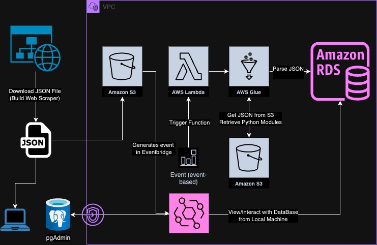

# ID304B-ETL

Every day, a publicly available website publishes data on covered entities. This data is very useful for describing the covered entities, their contact information and what medicaid and NPI numbers align with them. The data is slowly changing, so capturing changes is important.  

The covered entity data comes in JSON format, with described elements being saved in the nested JSON. Parsing the data takes time, with the number of nested documents changing for every covered entity. Fortunately, there is a reliable format for each covered entity so we can design a set of business entities that describe the covered entity and then take pieces of the JSON document and write them to the business entity.

The JSON documents are around 200 MB, and there is some logically checking against the data we already have to do the change data capture.

I wanted to create a fully automated pipeline that gets the data on a daily basis and load the parsed version into a database. What this repo shows is the automation from the point of the JSON document being saved into AWS S3 (object storage). I use a set of AWS services along with triggers to automate the pipeline from there, and have tested both the relational database logic locally and the automation logic on AWS using samples of the JSON data.

## Architecture Overview

This project implements an automated ETL pipeline that processes covered entity data from S3 and loads it into a PostgreSQL database using AWS services.



## AWS Services

- **AWS S3**
  - Stores raw JSON files containing covered entity data
  - Configured with VPC Endpoint for secure access within the VPC
- **Amazon EventBridge**
  - Monitors S3 bucket for new file uploads
  - Automatically triggers Lambda function when new files are detected
  - Event pattern rule configured to detect object creation in specific bucket
- **AWS Lambda**
  - Receives S3 event notifications via EventBridge
  - Triggers Glue ETL job with file information
- **AWS Glue**
  - Processes the raw JSON data
  - Implements transformation logic and business rules
  - Loads processed data into PostgreSQL database
  - Uses custom Python libraries stored in S3
- **AWS RDS (PostgreSQL)**
  - Stores processed covered entity data in dimensional model
  - Configured in private subnet with appropriate security groups
  - Instance size: db.t4g.micro
- **AWS EC2**
  - Used for connecting to the database for administration
- **AWS IAM**
  - Role and policy management for secure service integration
  - Permission boundaries for Lambda and Glue job execution
- **AWS Secrets Manager**
  - Securely stores and manages database credentials

## Network Configuration

- **VPC Configuration**
  - Configured private subnets for RDS instance
  - Security groups to control traffic between services
  - NAT Gateway for outbound traffic from private subnets
  - S3 VPC Endpoint for secure access to S3 buckets
- **Security Groups**
  - Database security group with restricted access
  - Glue service security group with specific inbound/outbound rules
- **AWS Glue Connection**
  - Custom connection configured with VPC, subnet, and security group details
  - Enables Glue jobs to access resources within VPC

## Development Environment

- **Local Testing**
  - pgAdmin for local database testing and development
  - VS Code for script development
- **Dependencies**
  - `pg8000` for PostgreSQL connectivity
    ```
    pip install pg8000 --target .
    zip -r pg8000.zip .
    ```
  - External libraries required for Glue job:
    - s3://my-dependencies-cw/glue-libs/pg8000.zip
    - s3://my-dependencies-cw/sqlalchemy.zip
    - s3://my-dependencies-cw/etl.zip

## Data Model

### Business Entities
- `dim_ce` - Core covered entity dimension
- `dim_ce_medicaid_numbers` - Medicaid identifiers for covered entities
- `dim_npi` - National Provider Identifiers
- `dim_ce_street_address` - Physical addresses
- `dim_ce_billing_address` - Billing information
- `dim_ce_shipping_address` - Shipping details
- `dim_ce_contract_pharmacy` - Contract pharmacy relationships
- `dim_pharmacy` - Pharmacy information

## ETL Process

### Data Source
- Daily JSON files containing covered entity information
- Files uploaded to designated S3 bucket (`and-health-bucket`)
- Data is sourced from the [HRSA 340B OPAIS Daily Reports](https://340bopais.hrsa.gov/help/Reports/DailyReports.htm)

### Process Flow
1. New JSON file uploaded to S3 bucket
2. EventBridge rule detects the S3 object creation event using this pattern:
   ```json
   {
     "source": ["aws.s3"],
     "detail-type": ["Object Created"],
     "detail": {
       "bucket": {
         "name": ["and-health-bucket"]
       }
     }
   }
   ```
3. Lambda function triggered with the S3 event details
4. Lambda extracts bucket and key information
5. Lambda invokes Glue job with appropriate parameters
6. Glue job connects to the PostgreSQL database
7. Glue job processes and transforms data
8. Transformed data loaded into dimensional tables

### Change Data Capture (CDC)
- Composite key of `id304b` and `ceId` serves as unique identifier
- Records searched and updated based on composite key
- Expiration date set for old records during updates
- "Current version" flag set to "Y" for active records and "N" for historical/expired records

## Deployment and Configuration

### EventBridge Setup
- Event pattern configured to detect S3 object creation
- Target configured to invoke Lambda function

### Lambda Function
- Extracts S3 bucket and object information
- Passes parameters to Glue job

### Glue Job Setup
- Job parameters:
  - Database credentials (user, password, host, name)
  - S3 bucket and key information
- Processes entities from JSON file
- Handles database connections and data loading
- Additional Python libraries imported from S3 bucket

## Monitoring and Maintenance

### CloudWatch Metrics
- Lambda function invocation count
- Lambda function duration and error metrics
- Glue job success/failure metrics
- CPU utilization for Glue job
- RDS instance CPU utilization and connection count
- Custom metrics for record counts and processing time

## Security Considerations

AWS Secrets Manager is used to securely store and retrieve database credentials, eliminating the need to hardcode sensitive information in the code or configuration files. All service communications occur within VPC where possible, with appropriate IAM roles limiting permissions to the minimum required for each service.

## Future Enhancements

- Develop a web scraper to automatically download the daily JSON file from the source website
- Implement data quality validation checks
- Add notification system for failed jobs
- Create a dashboard for monitoring data processing metrics
- Implement data archiving strategy for historical records

## Troubleshooting

### Common Issues and Solutions

- **Service Connectivity Issues**: Confirm that all services are in the same VPC. Some services require internet access via NAT Gateway or appropriate VPC endpoints.

- **Python Module Import Errors**: When working with non-native Python modules in AWS Glue:
  - Verify the Python version used by Glue (currently Python 3.9)
  - Install necessary packages with the correct Python version
  - Create zip files of the packages and upload them to S3
  - Reference these S3 paths in your Glue job configuration

- **Database Connection Issues**:
  - Verify security group inbound rules allow connections from Glue job
  - Check that the Glue connection has correct subnet and security group configuration
  - Ensure database credentials are correctly stored in AWS Secrets Manager

- **EventBridge Rule Not Triggering**:
  - Verify S3 bucket has EventBridge notifications enabled
  - Check EventBridge rule pattern matches the exact bucket name
  - Ensure Lambda has appropriate permissions to be invoked by EventBridge

## Repository Structure

- **etl.py**: A Python module that parses JSON files and handles change data capture.
- **modules/**: Contains all the zipped modules required for AWS Glue, including:
  - `etl.zip`
  - `pg8000.zip`
  - `psycopg2.zip`
- **ddl/**: Contains the database schema definition scripts. Each file corresponds to a business entity.
- **ID304B/**: Contains the AWS Glue job script:
  - `ID304B-ETL.py`: The main Glue job script used for data processing.
